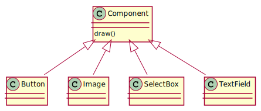
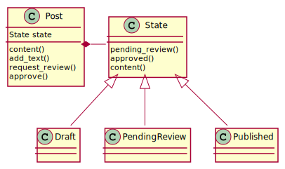
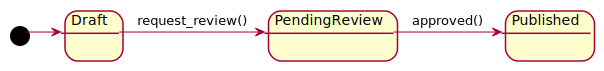

<!-- paginate: true -->

<style scoped>
section {
  justify-content: center;
}
</style>

# 17. Rustのオブジェクト指向プログラミング機能


2021/11/26
GtTmy

---

## 今回の範囲
- The Rust Programing Language 日本語版
  - `17. Rustのオブジェクト指向プログラミング機能`
  - https://doc.rust-jp.rs/book-ja/ch17-00-oop.html
  - 必要に応じて英語版(https://doc.rust-lang.org/book/ch17-00-oop.html) も参照します
  - MIT ライセンス (https://github.com/rust-lang-ja/book-ja/blob/master-ja/LICENSE-MIT )
---

## オブジェクト指向プログラミング (OOP)

- アラン・ケイ, 1950年代後半 - 1960年代前半
- 「オブジェクト」が互いにメッセージを渡し合う
- 多くの **競合する** 定義

- オブジェクト指向と捉えられているデザインパターンの、Rustでの表現方法を説明する

---

# 17.1 オブジェクト指向言語の特徴

> 言語がオブジェクト指向と考えられるのになければならない機能について、プログラミングコミュニティ内での総意はありません。

ここでは、一般的にオブジェクト指向と捉えられている機能について説明する。

---

## オブジェクトは、データと振る舞いを含む

GoF (the Gang of Four book, "デザインパターン: 再利用可能なオブジェクト指向ソフトウェアの要素") という本でのOOPの定義は下記。

> オブジェクト指向プログラムは、オブジェクトで構成される。オブジェクトは、 データとそのデータを処理するプロシージャを梱包している。このプロシージャは、 典型的にメソッドまたはオペレーションと呼ばれる。

Rustは、
- データを保持する構造体/enum
- 構造体/enumにメソッドを提供する`impl`

で同じ機能を提供する。

---

## カプセル化は、実装詳細を隠蔽する

- 公開されたAPI経由でのみオブジェクトと相互作用できること。
- 公開されていないAPIを操作してオブジェクトの振る舞いを変更できないこと。

Rustでは `pub` キーワードでカプセル化を実現できる。

たとえば、下記の構造体は `pub` が付与されているので他のコードから使用できるが、フィールドは非公開のため使用できない。

```rust
pub struct AveragedCollection {
    list: Vec<i32>,
    average: f64,
}
```

---

AveragedCollection構造体のデータの操作は `pub` メソッド経由でしかできない。

```rust
impl AveragedCollection {
    // データを追加し、平均を更新
    pub fn add(&mut self, value: i32) {
        self.list.push(value);
        self.update_average();
    }
    // 平均を取得
    pub fn average(&self) -> f64 {
        self.average
    }
    // 平均を更新する非公開のメソッド
    fn update_average(&mut self) {
        let total: i32 = self.list.iter().sum();
        self.average = total as f64 / self.list.len() as f64;
    }
}
```

これによって、例えば `list` の型を`HashSet`に変えたとしても、AverageCollectionを使う外部コードは変更しなくてすむ。

---

## 型システム、およびコード共有としての継承

オブジェクトが他のオブジェクトの定義を受け継ぐ機構。動作の再定義を減らすことができる。

継承で主に実現したいことは下記の2つ。Rustに継承はないが、他の手段で下記を実現できる。

1. コードの再利用
   - トレイトメソッドのデフォルト実装がほぼ同じ機能を提供
2. 多相性(Polymorphism, ポリモーフィズム)
   - ここでいうポリモーフィズムは サブタイピング (https://ja.wikipedia.org/wiki/%E3%83%9D%E3%83%AA%E3%83%A2%E3%83%BC%E3%83%95%E3%82%A3%E3%82%BA%E3%83%A0 参照)
   - 親の型の代わりに子の型を使う
   - Rustは継承ではなく **トレイトオブジェクト** を使用して多相性を実現する

---

## 多相性

C#を例に使う。
下記のように、親クラスのように取り扱えるが実際の処理はサブクラスが行うこと。(オブジェクト指向言語における多相性であることに注意。)

```csharp
class Dog {
  public virtual string bark() => "baw, baw";
}
class Snoopy: Dog {
  public override string bark() => "Hello";
}
// Main
Dog dog = new Snoopy();  // 静的にはDogだが、動的にはSnoopy
Console.WriteLine(dog.bark()); // -> "Hello"
```

---

継承による多相性の実現には柔軟性がない。(一部のメソッドのみに制限できない、多重継承を認めない言語では設計に制限が生じる)

```csharp
class Dog {
  public virtual string bark() => "baw, baw";
  public virtual void eat(Food x) { /* hoge */};
}
class Aibo: Dog {
  public override string bark() => "beep";
  // ご飯は食べないのに、eatも実装される...
}
```

---

# 17.2 トレイトオブジェクトで異なる型の値を許容する

トレイトオブジェクトの説明のためにGUIフレームワークを考える。
- GUIの各要素は `draw` メソッドを持つ
- `draw`が実行されると、自身を画面内に描画する

オブジェクト指向言語では、一般的には下記のように設計する。



これをRustで実現する。

---

## 共通の振る舞いにトレイトを定義する

下記のトレイトオブジェクトの特徴を確認していく。

- トレイトオブジェクト
  - 指定したトレイトを実装する型のインスタンス を指す ポインタ (参照/スマートポインタ)
  - トレイトを実装していることはコンパイル時に保証する。実際にどのメソッドが実行されるかは動的に決まる。


まず、`draw()` メソッドを持つトレイト `Draw` を定義する。

```rust
pub trait Draw {
    fn draw(&self);
}
```

これは今まで出てきたトレイトと同じ記法。

---

次に、トレイトオブジェクト `Box<dyn Draw>` のベクタを持つ `Screen` 構造体を定義する。

```rust
pub struct Screen {
    pub components: Vec<Box<dyn Draw>>,  // 日本語版は文法が古いので注意 (dynを明記していない)
} 
```

`Screen` に対してはすべての `component` の `draw()`を実行するメソッドを定義しておく。

```rust
impl Screen {
    pub fn run(&self) {
        for component in self.components.iter() {
            component.draw();  // component がどの型かは問わない。Drawを実装していれば良い
        }
    }
}
```

---

今までに学習したトレイト境界を伴うジェネリック型引数では下記のようになる。

```rust
pub struct Screen<T: Draw> {
    pub components: Vec<T>,
}
impl<T> Screen<T>
    where T: Draw {
    pub fn run(&self) {
        for component in self.components.iter() {
            component.draw();
        }
    }
}
```

上手くいきそうな雰囲気があるが、これは間違い。`component` は1つの型しか受け付けない。(ex. TextBox, Button)

---

## トレイトを実装する

具体的にこのトレイトを実装する型の例を示す。

```rust
pub struct Button {
    pub width: u32,
    pub height: u32,
    pub label: String,
}
impl Draw for Button {
    fn draw(&self) {
        // 実際にボタンを描画するコード
    }
}
```

guiライブラリのユーザーは`Draw`を自前で実装すれば、好きな構造体を描画させることができる。これは **ダックタイピング** に似ている。

---

動的型付け言語のダックタイピングと違い、Rustでは呼び出しがうまくいくことが静的に保証される。

```rust
fn main() {
    let screen = Screen {
        components: vec![
            Box::new(String::from("Hi")),
        ],
    };
    screen.run();
}
```

`String` は `Draw` を実装していないので、上記はコンパイルエラーになる。

---

## トレイトオブジェクトは、ダイナミックディスパッチを行う

- ダイナミックディスパッチ
  - トレイトオブジェクトを使った場合のメソッド呼び出し
  - 実行時にどのメソッドを呼び出すかを判定するコードが追加される
- スタティックディスパッチ
  - ジェネリック型引数を使った場合のメソッド呼び出し
  - コンパイル時にどのメソッドが呼び出されるか決まる

ダイナミックディスパッチは実行時コストがあるので注意。

---

## トレイトオブジェクトには、オブジェクト安全性が必要

- オブジェクト安全なトレイトのみトレイトオブジェクトにできる
- オブジェクト安全なトレイトの条件
  - 戻り値の型がSelfでない。
  - ジェネリックな型引数がない。

`Self` は　`self` の型を表す別名。例として`Clone`トレイトを示す。

```rust
pub trait Clone {
    fn clone(&self) -> Self;
}
```

`Self`を許すと、実際に呼び出されたメソッドに応じて異なる型が返ってくる事になる。

--- 
## この節のまとめ

- トレイトオブジェクト
  - `Box<dyn T>`
  - あるトレイトを実装した **型一般** を指す
  - トレイトを実装していることはコンパイル時に保証する。実際にどのメソッドが実行されるかは動的に決まる。
- トレイト境界付きジェネリック型引数
  - `T`
  - あるトレイトを実装した **特定の型**
  - 実行時に呼び出されるメソッドは静的に決まる。

「コンパイル時に大きさが決まらないといけない」という特徴を考えるとわかりやすい。ある型を実装した型一般 は大きさが決まらないのでポインタで持つ必要がある。

---

# 17.3 オブジェクト指向デザインパターンを実装する

この節では、「ブログ記事の状態管理」をモチーフに **ステートパターン** というデザインパターンをRustで実装できることを示す。

更に、Rustにおいてより良い設計ができることを示す。


---

## お題: ブログ記事の状態管理

- ブログには、Draft, PendingReview, Publishedの3状態がある
- レビューを要求すると、DraftからPendingReviewに遷移する
- 承認されると PendingReview からPublishedに遷移する
- 公開されたブログ記事だけが表示する内容を返す。未承認の記事は公開されない。

---

mainからは下記のように利用する想定。

```rust
fn main() {
    let mut post = Post::new();

    // 今日はお昼にサラダを食べた
    post.add_text("I ate a salad for lunch today");
    assert_eq!("", post.content());

    post.request_review();
    assert_eq!("", post.content());

    post.approve();
    assert_eq!("I ate a salad for lunch today", post.content());
}
```

---

## ステートパターン

> Stateパターンは、状態をクラスとして表現し、クラスを切り替えることによって「状態の変化」を表す方式です。([デザインパターン ～State～ - Qiita](https://qiita.com/i-tanaka730/items/49ee4e3daa3aeaf6e0b5))






---

## Rustで実装する

実装を進める。

まず、Stateトレイトを定義する。

```rust
trait State {
    fn request_review(self: Box<Self>) -> Box<State>;
    fn approve(self: Box<Self>) -> Box<State>;
    fn content<'a>(&self, post: &'a Post) -> &'a str {
        ""
    }
}
```

Stateを定義。

```rust
struct Draft {}
struct PendingReview {}
struct Published {}
```

---

各Stateに状態遷移を実装。Publishedには`content()`も実装。

```rust
impl State for Draft {
    // 所有権を奪うメソッド
    fn request_review(self: Box<Self>) -> Box<State> {
        Box::new(PendingReview {})  // 次の状態に遷移
    }
    // 状態遷移しない時は自分自身を返す
    fn approve(self: Box<Self>) -> Box<State> { self }
}
impl State for PendingReview {
    fn request_review(self: Box<Self>) -> Box<State> { self }
    fn approve(self: Box<Self>) -> Box<State> {
        Box::new(Published {})
    }
}
impl State for Published {
    fn request_review(self: Box<Self>) -> Box<State> { self }
    fn approve(self: Box<Self>) -> Box<State> { self }
    fn content<'a>(&self, post: &'a Post) -> &'a str {
        // publishedの時だけcontentを返す
        &post.content
    }
}
```

---

Postを定義。

```rust
pub struct Post {
    state: Option<Box<State>>,  // Option の理由は後述
    content: String,
}
impl Post {
    pub fn new() -> Post {
        Post {
            state: Some(Box::new(Draft {})),  // 初期化時はDraft
            content: String::new(),
        }
    }
    pub fn add_text(&mut self, text: &str) {  // テキストの追加
        self.content.push_str(text);
    }
    pub fn request_review(&mut self) {  // 状態の更新 (あとで説明)
        if let Some(s) = self.state.take() {
            self.state = Some(s.request_review());
        }
    }
    pub fn approve(&mut self) {  // 状態の更新 (あとで説明)
        if let Some(s) = self.state.take() {
            self.state = Some(s.approve());
        }
    }
    pub fn content(&self) -> &str { // contentの取得 (あとで説明)
        self.state.as_ref().unwrap().content(&self);
    }
}
```

---

## `state` が `Option` の理由

本当は下記のように書きたい。

```rust
pub struct Post {
    state: Box<State>, 
}
impl Post {
    pub fn request_review(&mut self) {
        self.state = self.state.request_review()
        //                ^^^^^^^^^^^^^^^^^^^^^^
        // self が &mut なので所有権を奪うことはできない
    }
}
```

---

```rust
pub struct Post {
    state: Option<Box<State>>, 
    content: String,
}
impl Post {
    pub fn request_review(&mut self) {
        // ここでstate の所有権を取得する。 
        if let Some(s) = self.state.take() {  
            // 所有権を奪っているので s.request_review が実行できる
            self.state = Some(s.request_review())
        }
    }
}
```
`State` のメソッドは所有権を奪う。`take`は`Option`型から中身を取得して`None`で置き換えるメソッド。


---

`content()` について

```rust
impl Post {
    pub fn content(&self) -> &str {
        self.state.as_ref().unwrap().content(&self);
    }
}
impl State for Published {
    fn content<'a>(&self, post: &'a Post) -> &'a str {
        // publishedの時だけcontentを返す
        &post.content
    }
}
```

`as_ref`は`Option<&Box<State>>`を返す。Stateのままだと所有権を奪ってしまうため、`as_ref`が必要。

(難しい。。。)

---

## ステートパターンの長所/短所

- ステートパターンの長所
  - 状態を逆に遷移させる機能も追加できる
  - 状態を追加する時にPostを変更しなくて良い
    - 新状態の構造体、メソッドを追加
- ステートパターンの短所
  - 状態追加時に、前の状態のメソッドを更新する必要がある
  - ロジックの重複が多い
    - 各Stateの`request_review()`と`approve()`
    - Postの`request_review()`と`approve()`がほぼ同じ
    - (私見) Publishedに `approve()`が実装されるなど、ありえない状態遷移も実装される

---

## 状態と振る舞いを型としてコード化する

オブジェクト指向な実装をやめて、Rustの強みを生かした実装をする。
Postの内部状態を変更するのではなく、処理を実行するたびに異なる型が返ってくるように変更する。

---

Postを状態ごとに定義する。

```rust
pub struct Post {  // Published 相当
    content: String,
}
pub struct PendingReviewPost {  // PendingReview 相当
    content: String,
}
pub struct DraftPost {  // Draft 相当
    content: String,
}
```

---

それぞれの構造体に、次の構造体を返すメソッドを追加。

```rust
impl Post {
    pub fn new() -> DraftPost {
        DraftPost { content: String::new(), }
    }
    pub fn content(&self) -> &str { &self.content }
}
impl PendingReviewPost {
    pub fn approve(self) -> Post {
       Post { content: self.content, }
    }
}
impl DraftPost {
    pub fn add_text(&mut self, text: &str) {
        self.content.push_str(text);
    }
    pub fn request_review(self) -> PendingReviewPost {
        PendingReviewPost { content: self.content, }
    }
}
```

---

mainも少し変更が必要。

```rust
fn main() {
    let mut post = Post::new();
    post.add_text("I ate a salad for lunch today");
    let post = post.request_review();
    let post = post.approve();
    assert_eq!("I ate a salad for lunch today", post.content());
    //  content()はPostにしか実装されていない!           ^^^^^^^^^
}
```

shadowingによって`post`を使い回しているが、実際は型が変わっている。(<--> 先ほどの設計では内部状態の更新)

---

## Rustらしい設計のいいところ

- ありえない処理はそもそも定義されていない
  - 例. PendingReview に対する`content()`
  - 例. Draftに対する`approve()`
- 定義されていないので、実行しようとするとコンパイルエラー
  - オブジェクト指向設計の場合、実行時エラーにしかできない。

(そもそも、今回の例ではステートパターンを取るべきなのか疑問ではある。各ステートに対して同じ名前のメソッドが定義できて、かつメソッドの挙動がステートに依存して違う場合に使うべき設計の気がする。)

---

## まとめ

Rustの機能はオブジェクト指向言語のデザインパターンを再現できる。

- 可視性の制御によってカプセル化が実現できる
- Rustに継承はないが、**トレイトオブジェクト** で似たことができる
  - ダイナミックディスパッチになるので、実行時にコストが発生していることに注意
- オブジェクト指向言語で使われるデザインパターンである、ステートパターンがRustで記述できる。
  - ただし、Rustらしい設計の方がわかりやすく安全なこともある

---

## 積み残し

- `dyn` キーワードが導入された理由
  - [RFC 2113: dynトレイト構文 - gist](https://gist.github.com/sile/0615a6daa1f5576d63c8775cc5a94f88)
- 継承に対する最近のトレンドが気になる
  - Go に継承は無い(らしい)。 interfaceはある
